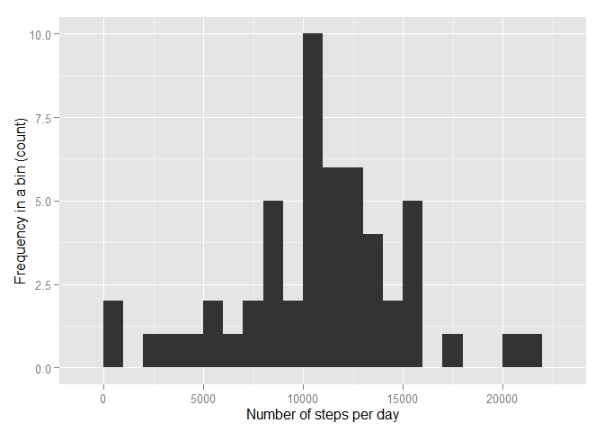
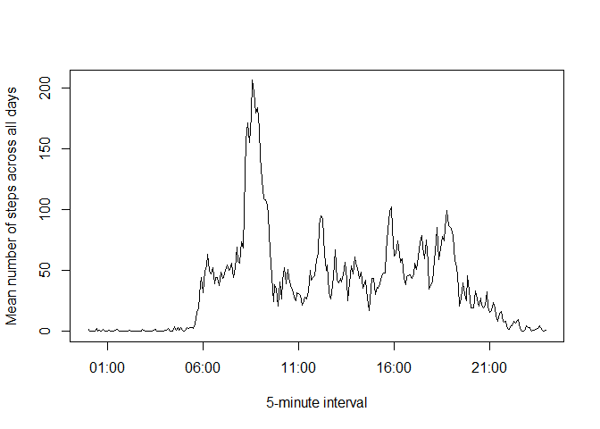
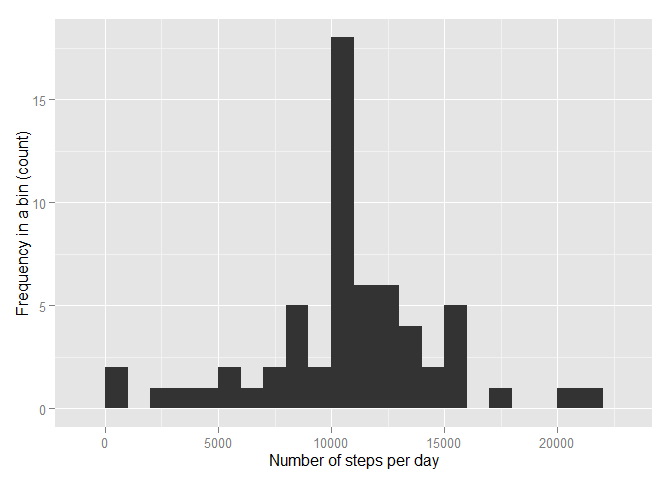
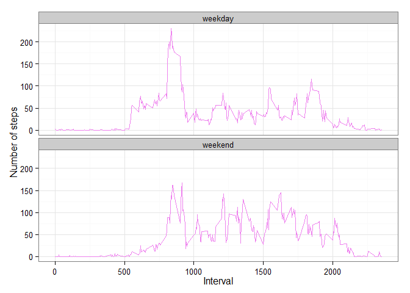

# PA1_template
Dang Hai Dang  
Saturday, November 15, 2014  
#### Loading and preprocessing the data

```r
library(zoo)
```

```
## 
## Attaching package: 'zoo'
## 
## The following objects are masked from 'package:base':
## 
##     as.Date, as.Date.numeric
```

```r
library(ggplot2)
unzip(zipfile="activity.zip")
data <- read.csv("activity.csv", colClasses = c("integer","character","integer"))
```
#### What is mean total number of steps taken per day?

##### Histogram of the total number of steps taken perday?

```r
data$date <- as.Date(data$date)
sum_data <- aggregate(steps ~ date, data = data, FUN = sum)  
qplot(steps, data = sum_data, binwidth = 1000, geom = "histogram",
      xlab = "Number of steps per day", ylab = "Frequency in a bin (count)")
```

 

##### Calculate and report the mean and median total number of steps taken per day

```r
mean_data <- mean(sum_data$steps)
median_data <- median(sum_data$steps)
print(mean_data)
```

```
## [1] 10766
```

```r
print(median_data)
```

```
## [1] 10765
```

#### What is the average daily activity pattern?

##### Make time series plot of the 5-minute interval and the average number of steps taken, averaged across all days

```r
ave_interval <- aggregate(steps ~ interval,data = data, FUN = mean)
sort_ave_interval <- ave_interval[order(ave_interval$interval),]
time_sequence <- seq(from = as.POSIXct("2012-01-10 00:00"), to = as.POSIXct("2012-01-10 23:55"), by = 300)
ts_plot <- zoo(sort_ave_interval$steps,time_sequence)
plot(ts_plot, xlab = "5-minute interval", 
     ylab = "Mean number of steps across all days")
```

 

##### 5-minute interval contains the maximum number of steps

```r
ave_interval[which.max(ave_interval$steps),]
```

```
##     interval steps
## 104      835 206.2
```

#### Imputing missing values

##### Calculate and report the total number of missing values in the dataset

```r
sapply(data, function(x) sum(is.na(x)))
```

```
##    steps     date interval 
##     2304        0        0
```

#### Fill NAs Value and create new dataset  

```r
copy_data <- data
na_value <- data[which(is.na(data)),]
na_value$steps <- rep(sort_ave_interval$steps,8)
copy_data[which(is.na(copy_data)),] <- na_value
```

##### Test to see are there any NA value in the new dataset

```r
any(is.na(copy_data))
```

```
## [1] FALSE
```

##### Make histogram for the total number of steps taken each day 

```r
new_sum_data <- aggregate(steps ~ date, data = copy_data, FUN = sum)  
qplot(steps, data = new_sum_data, binwidth = 1000, geom = "histogram",
      xlab = "Number of steps per day", ylab = "Frequency in a bin (count)")
```

 

```r
new_mean_data <- mean(new_sum_data$steps)
new_median_data <- median(new_sum_data$steps)
print(new_mean_data)
```

```
## [1] 10766
```

```r
print(new_median_data)
```

```
## [1] 10766
```


##### Report mean and median value of total number of steps per day for the filled-in missing value dataset

```r
new_mean_data <- mean(new_sum_data$steps)
new_median_data <- median(new_sum_data$steps)
print(new_mean_data)
```

```
## [1] 10766
```

```r
print(new_median_data)
```

```
## [1] 10766
```

#### Are there differences in activity pattern between weekdays and weekends?

##### Create new factor with two level weekday and weekend

```r
wd <- weekdays(copy_data$date)
for(i in 1:length(wd)){
    if(wd[i] == "Saturday" | wd[i] == "Sunday"){
        wd[i] = "weekend"
    }
    else{
        wd[i] = "weekday"
    }
}    
copy_data$weekdate <- wd
```

#### time series plots of the 5-minute interval and the average number of steps taken, averaged across weekday and weekend

```r
new_data <- split(copy_data, copy_data$weekdate )
weekday_interval <- aggregate(steps ~ interval,data = new_data$weekday, FUN = mean)
weekday_interval$weekdate <- "weekday" 
weekend_interval <- aggregate(steps ~ interval,data = new_data$weekend, FUN = mean)
weekend_interval$weekdate <- "weekend" 
to_plot <- rbind(weekday_interval,weekend_interval)
ggplot(to_plot, aes(x=interval, y=steps)) + 
  geom_line(color="violet") + 
  facet_wrap(~ weekdate, nrow=2, ncol=1) +
  labs(x="Interval", y="Number of steps") +
  theme_bw()
```

 
